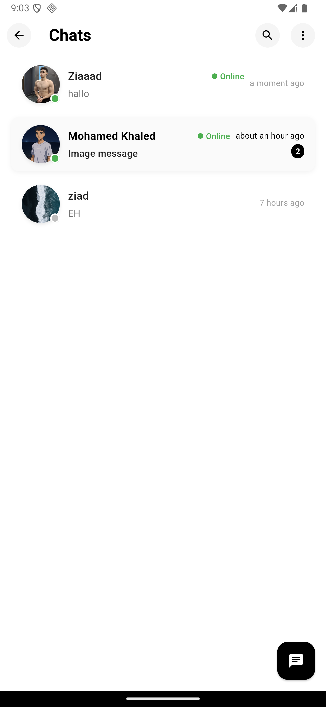
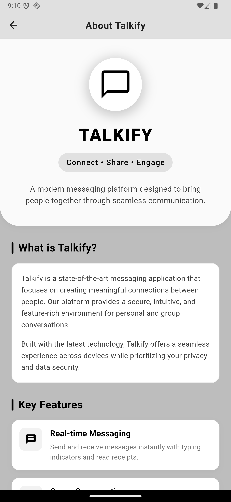
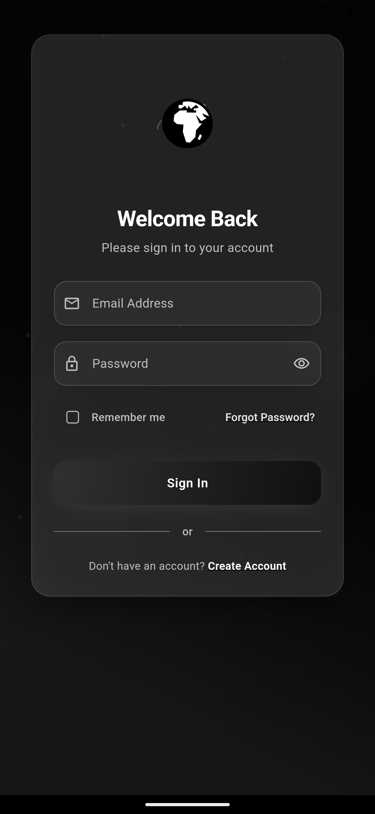
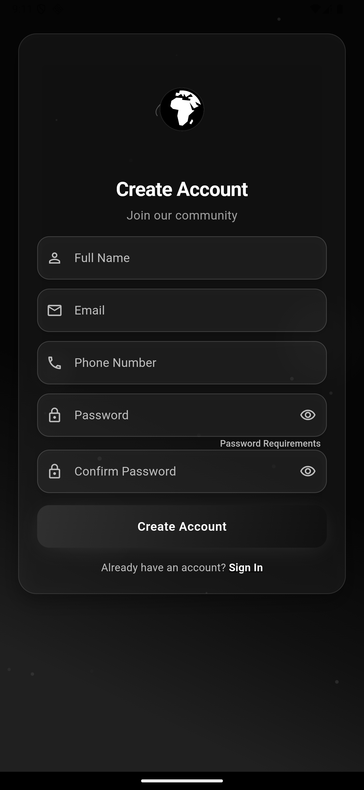
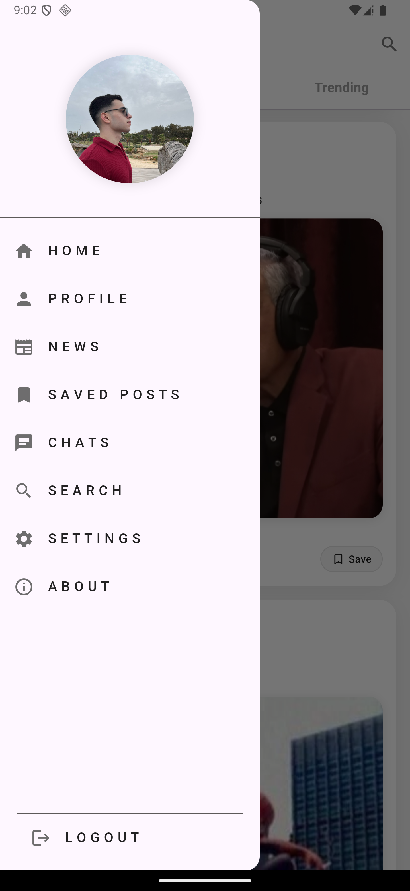

# Talkify - Modern Social Media & Communication Platform

<div align="center">
  
</div>

## Overview

Talkify is a feature-rich social media and communication platform built with Flutter. It combines modern design with a robust architecture to deliver a seamless user experience. The app uses Firebase services for backend functionality and follows clean architecture principles with BLoC/Cubit state management.

## Key Features

### 🔐 Authentication
- Email & password login/registration
- Account verification
- Profile setup and customization
- Secure authentication flow with Firebase

### 💬 Real-time Chat
- One-on-one and group messaging
- Media sharing (photos, videos, audio)
- Message status indicators (sent, delivered, read)
- Typing indicators
- Message search and history

### 📱 Social Feed
- Create and share posts with text, images, and videos
- Like, comment, and share functionality
- Rich media support
- Interactive post engagement

### 🔍 Advanced Search
- Find users, posts, and content
- Filter and sorting options
- Suggested connections
- Discovery features

### 📰 News Feed
- Curated content based on interests
- Latest updates from connections
- Trending topics
- Personalized recommendations

### 👤 Profile Management
- Customizable user profiles
- Activity history
- Profile analytics
- Connection management

### 🔔 Smart Notifications
- Real-time push notifications
- Customizable notification preferences
- Activity alerts
- Mention and tag notifications

### ⚙️ Settings & Customization
- App theme customization
- Privacy controls
- Data management
- Account settings

## Screenshots

<div align="center">
  <div style="display: flex; flex-wrap: wrap; justify-content: center; gap: 10px;">
    
    
    
    
    
    
  </div>
</div>

## Architecture

Talkify follows a clean architecture approach with a modular feature-based structure:

```
lib/
├── features/
│   ├── auth/            # Authentication feature
│   ├── Chat/            # Messaging functionality
│   ├── Posts/           # Social feed and posts
│   ├── Profile/         # User profiles
│   ├── News/            # News feed
│   ├── Notifications/   # Notification system
│   ├── Search/          # Search functionality
│   ├── Settings/        # App settings
│   └── Storage/         # Data storage
└── theme/               # App styling and themes
```

Each feature is organized into three layers:

- **Domain**: Business logic and entities
- **Data**: Repository implementations and data sources
- **Presentation**: UI components and state management

## State Management

Talkify uses BLoC/Cubit pattern for state management, providing:

- Predictable state transitions
- Testable business logic
- Separation of UI and business logic
- Reactive programming approach

## Backend Services

- **Firebase Authentication**: User management
- **Cloud Firestore**: NoSQL database for app data
- **Firebase Storage**: Media storage
- **Firebase Cloud Messaging**: Push notifications

## Getting Started

### Prerequisites

- Flutter SDK (>=3.0.0)
- Dart SDK (>=3.0.0)
- Firebase project setup

### Installation

1. Clone the repository
   ```
   git clone https://github.com/yourusername/talkifyapp.git
   ```

2. Install dependencies
   ```
   flutter pub get
   ```

3. Run the app
   ```
   flutter run
   ```

## Contributing

Contributions are welcome! Please feel free to submit a Pull Request.

## License

This project is licensed under the MIT License - see the LICENSE file for details.

## Contact

For support or inquiries, please contact [ziadelsewedy1@gmail.com](mailto:ziadelsewedy1@gmail.com)
