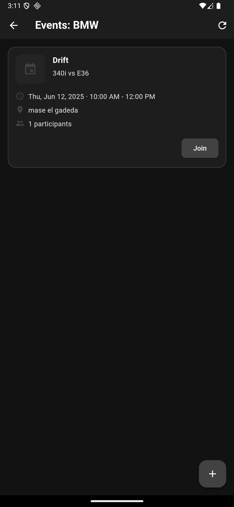
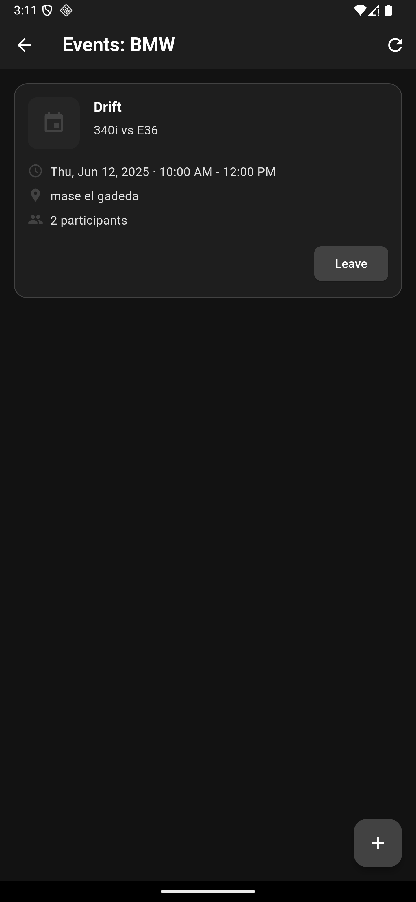
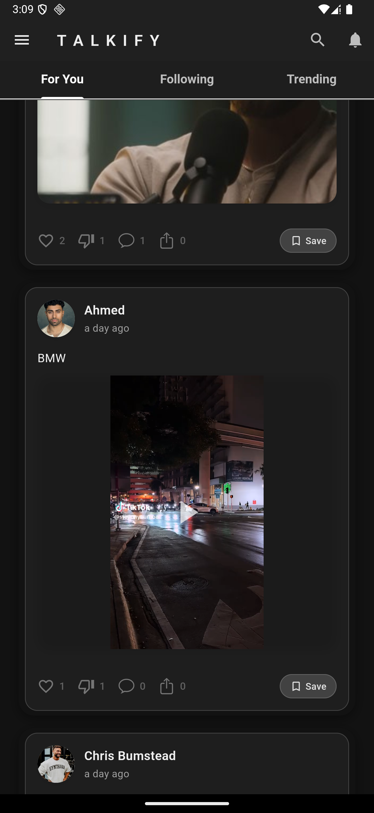
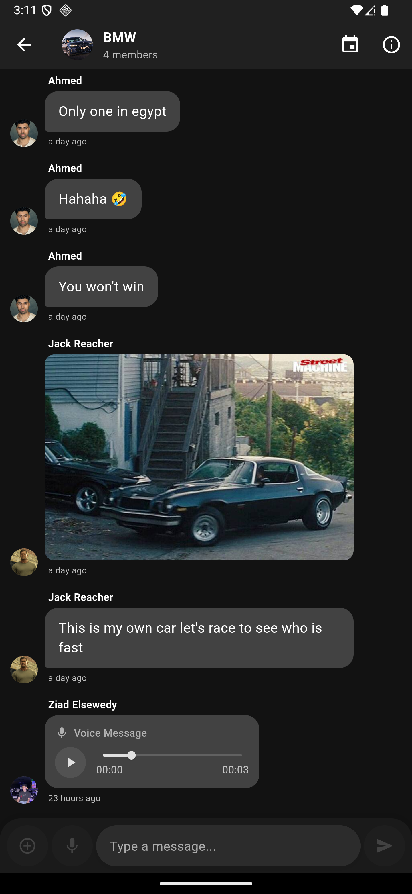
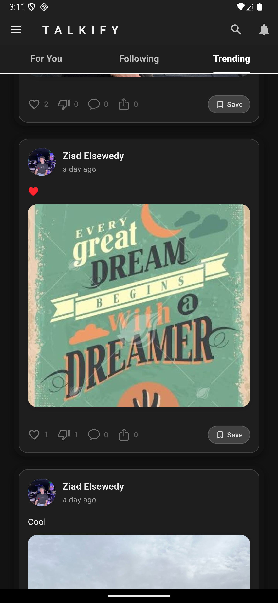
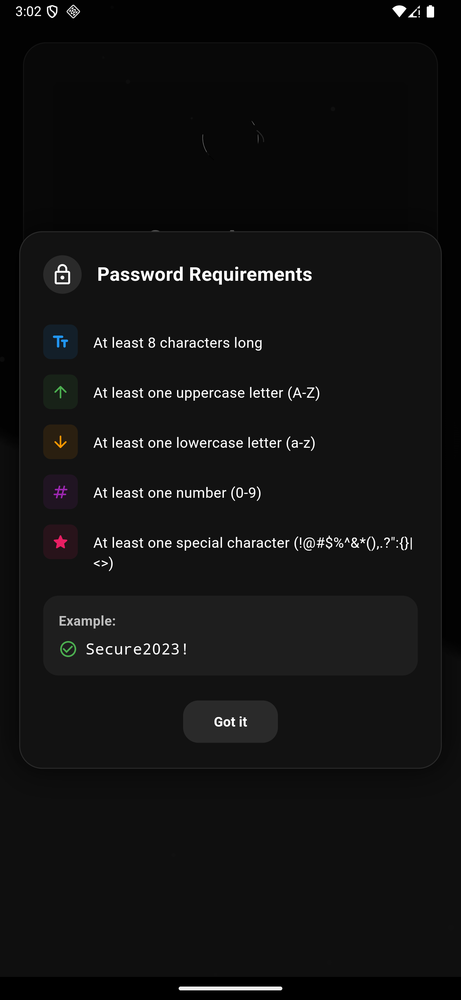

# Talkify - Next-Generation Social Media Platform

<div align="center">
  
  
  **Connect • Share • Communicate**
  
  [](https://flutter.dev)
  [](https://firebase.google.com)
  [](https://dart.dev)
</div>

## 🌟 Overview

Talkify is a cutting-edge social media and communication platform built with Flutter, combining the best of social networking, real-time messaging, and community engagement. With its sleek dark-themed design and comprehensive feature set, Talkify offers users a modern, intuitive way to connect, share, and stay updated with their interests and communities.

## ✨ Key Features

### 🔐 **Advanced Authentication System**
- **Secure Registration & Login**: Email/password authentication with Firebase
- **Email Verification**: Complete verification workflow with resend functionality  
- **Password Security**: Advanced password requirements with strength validation
- **Password Recovery**: Seamless forgot password with email reset links
- **Account Management**: Profile setup, customization, and secure account deletion

### 💬 **Real-Time Chat & Messaging**
- **Individual & Group Chats**: One-on-one and multi-participant conversations
- **Rich Media Support**: Send images, videos, audio messages, and files
- **Voice Messages**: Record and send voice notes with playback controls
- **Message Status**: Real-time delivery and read receipts
- **Typing Indicators**: Live typing status updates
- **Message Search**: Find messages across chat history
- **Media Gallery**: Organized media sharing and viewing

### 🏘️ **Communities & Interest Groups**
- **Community Discovery**: Browse and join communities based on interests
- **Custom Communities**: Create communities with customizable settings and rules
- **Member Management**: Role-based access (Member, Moderator, Admin)
- **Community Chat**: Dedicated group discussions for each community
- **Privacy Controls**: Public and private community options
- **Event Management**: Create and manage community events and activities

### 📱 **Social Feed & Posts**
- **Rich Content Sharing**: Create posts with text, images, and videos
- **Interactive Engagement**: Like, comment, and share functionality
- **Feed Algorithms**: Personalized content based on interests and connections
- **Story Features**: Share temporary content with followers
- **Content Discovery**: Explore trending posts and topics
- **Save Posts**: Bookmark content for later viewing

### 🔍 **Advanced Search & Discovery**
- **Universal Search**: Find users, posts, communities, and content
- **Smart Suggestions**: AI-powered recommendations for connections
- **Filter Options**: Advanced filtering by content type, date, and relevance
- **Trending Content**: Discover what's popular in your network
- **Location-Based Discovery**: Find nearby users and events

### 📰 **Integrated News Feed**
- **Multi-Category News**: Politics, Business, Sports, Technology, and more
- **Breaking News Alerts**: Real-time notifications for important updates
- **Personalized Feed**: Curated content based on reading preferences
- **Article Sharing**: Share news articles within the platform
- **Trending Topics**: Stay updated with current events and discussions

### 👤 **Comprehensive Profile Management**
- **Customizable Profiles**: Rich profile customization with bio, interests, and media
- **Activity Tracking**: View followers, following, and post analytics
- **Social Statistics**: Track engagement and growth metrics
- **Privacy Settings**: Granular control over profile visibility
- **Connection Management**: Manage followers and following relationships

### 🔔 **Smart Notification System**
- **Real-Time Alerts**: Instant notifications for messages, mentions, and activities
- **Customizable Preferences**: Fine-tune notification settings per feature
- **Push Notifications**: Cross-platform notification support
- **Activity Summary**: Daily/weekly activity digests
- **Notification History**: Review past notifications and alerts

### ⚙️ **Settings & Customization**
- **Dark/Light Mode**: Adaptive theme with system preference support
- **Appearance Controls**: Customize UI elements and color schemes
- **Privacy Management**: Comprehensive privacy and security settings
- **Data Controls**: Manage personal data and storage preferences
- **Account Settings**: Profile, security, and notification management

## 📱 Screenshots

<div align="center">
  
  ### 🔐 Authentication & Onboarding
  <table>
    <tr>
      <td align="center"><b>Welcome Screen</b></td>
      <td align="center"><b>Sign Up</b></td>
      <td align="center"><b>Password Requirements</b></td>
      <td align="center"><b>Email Verification</b></td>
    </tr>
    <tr>
      <td></td>
      <td></td>
      <td></td>
      <td></td>
    </tr>
  </table>
  
  ### 📱 Main Features & Feed
  <table>
    <tr>
      <td align="center"><b>Main Feed</b></td>
      <td align="center"><b>Social Posts</b></td>
      <td align="center"><b>Content Sharing</b></td>
      <td align="center"><b>User Interactions</b></td>
    </tr>
    <tr>
      <td></td>
      <td></td>
      <td></td>
      <td></td>
    </tr>
  </table>
  
  ### 🏘️ Communities & Groups
  <table>
    <tr>
      <td align="center"><b>Communities List</b></td>
      <td align="center"><b>Community Details</b></td>
      <td align="center"><b>Community Rules</b></td>
      <td align="center"><b>Event Management</b></td>
    </tr>
    <tr>
      <td></td>
      <td></td>
      <td></td>
      <td></td>
    </tr>
  </table>
  
  ### 💬 Chat & Messaging
  <table>
    <tr>
      <td align="center"><b>Chat Interface</b></td>
      <td align="center"><b>Group Chat</b></td>
      <td align="center"><b>Media Sharing</b></td>
    </tr>
    <tr>
      <td></td>
      <td></td>
      <td></td>
    </tr>
  </table>
  
  ### 📰 News & Information
  <table>
    <tr>
      <td align="center"><b>News Feed</b></td>
      <td align="center"><b>Breaking News</b></td>
    </tr>
    <tr>
      <td></td>
      <td></td>
    </tr>
  </table>
  
  ### 👤 Profile & Settings
  <table>
    <tr>
      <td align="center"><b>User Profile</b></td>
      <td align="center"><b>Settings</b></td>
      <td align="center"><b>Privacy Controls</b></td>
      <td align="center"><b>Password Reset</b></td>
    </tr>
    <tr>
      <td></td>
      <td></td>
      <td></td>
      <td></td>
    </tr>
  </table>
  
</div>

## 🏗️ Architecture & Design

Talkify follows **Clean Architecture** principles with a modular, feature-based structure:

```
lib/
├── 🎨 theme/                 # App theming and design system
│   └── Cubits/              # Theme state management
├── 🔧 features/
│   ├── 🔐 auth/             # Authentication & user management
│   │   ├── data/            # Auth data sources & repositories
│   │   ├── domain/          # Auth business logic & entities
│   │   └── Presentation/    # Auth UI & state management
│   ├── 💬 Chat/             # Real-time messaging system
│   │   ├── Data/            # Chat data layer
│   │   ├── domain/          # Chat entities & repositories
│   │   ├── presentation/    # Chat UI components
│   │   ├── service/         # Chat services
│   │   └── Utils/           # Chat utilities
│   ├── 🏘️ Communities/      # Community management
│   │   ├── data/            # Community data layer
│   │   ├── domain/          # Community business logic
│   │   └── presentation/    # Community UI
│   ├── 📱 Posts/            # Social feed & content
│   │   ├── data/            # Posts data management
│   │   ├── domain/          # Posts business rules
│   │   └── presentation/    # Posts UI components
│   ├── 👤 Profile/          # User profiles & management
│   ├── 🔍 Search/           # Search & discovery
│   ├── 📰 News/             # News feed integration
│   ├── 🔔 Notifications/    # Notification system
│   ├── ⚙️ Settings/         # App configuration
│   ├── 💾 Storage/          # Data storage management
│   └── 🎉 Welcome/          # Onboarding experience
└── 📁 assets/               # App resources & media
```

### 🎯 Architecture Principles

- **Clean Architecture**: Separation of concerns with clear boundaries
- **SOLID Principles**: Maintainable and scalable code structure
- **Feature-Based Modularity**: Independent, reusable feature modules
- **BLoC/Cubit Pattern**: Predictable state management
- **Repository Pattern**: Abstract data access layer
- **Dependency Injection**: Loose coupling between components

## 🛠️ Technology Stack

### **Frontend**
- **Flutter 3.0+**: Cross-platform mobile development
- **Dart 3.0+**: Modern, type-safe programming language
- **BLoC/Cubit**: Reactive state management
- **Material Design 3**: Modern UI components and theming

### **Backend & Services**
- **Firebase Authentication**: Secure user authentication
- **Cloud Firestore**: NoSQL real-time database
- **Firebase Storage**: Cloud file storage
- **Firebase Cloud Messaging**: Push notifications
- **Firebase Analytics**: User behavior tracking

### **Key Dependencies**
```yaml
# State Management
flutter_bloc: ^9.1.1
equatable: ^2.0.5

# Firebase Integration
firebase_core: ^3.13.1
firebase_auth: ^5.5.4
cloud_firestore: ^5.6.8
firebase_storage: ^12.4.6

# Media & Communication
image_picker: ^1.1.2
audioplayers: ^6.4.0
just_audio: ^0.9.36
record: ^6.0.0
camera: ^0.11.0+2
video_player: ^2.8.1

# UI & UX
google_fonts: ^6.1.0
lottie: ^3.2.0
shimmer: ^3.0.0
animated_text_kit: ^4.2.2

# Utilities
dio: ^5.4.0
shared_preferences: ^2.2.2
permission_handler: ^12.0.0+1
connectivity_plus: ^6.1.4
```

## 🚀 Getting Started

### Prerequisites
- Flutter SDK (>=3.0.0)
- Dart SDK (>=3.0.0)
- Firebase project with required services enabled
- Android Studio / VS Code with Flutter extensions

### Installation

1. **Clone the repository**
   ```bash
   git clone https://github.com/yourusername/talkifyapp.git
   cd talkifyapp
   ```

2. **Install dependencies**
   ```bash
   flutter pub get
   ```

3. **Firebase Setup**
   - Create a new Firebase project
   - Add Android/iOS app to Firebase
   - Download and add configuration files:
     - `google-services.json` (Android)
     - `GoogleService-Info.plist` (iOS)
   - Enable Authentication, Firestore, and Storage

4. **Run the application**
   ```bash
   flutter run
   ```

### Firebase Configuration

Enable the following Firebase services:
- **Authentication**: Email/Password provider
- **Cloud Firestore**: Database for app data
- **Firebase Storage**: Media file storage
- **Cloud Messaging**: Push notifications
- **Analytics**: User behavior tracking (optional)

## 🎨 Design Philosophy

Talkify embraces a **modern, minimal aesthetic** with:

- **Dark-First Design**: Optimized for dark mode with eye-friendly interfaces
- **Consistent Branding**: Unified visual language across all features
- **Accessibility**: High contrast, readable fonts, and intuitive navigation
- **Responsive Layout**: Adaptive design for various screen sizes
- **Smooth Animations**: Fluid transitions and micro-interactions
- **Material Design 3**: Latest design principles and components

## 🔒 Security & Privacy

- **End-to-End Security**: Secure data transmission and storage
- **Privacy Controls**: Granular privacy settings for users
- **Data Protection**: GDPR-compliant data handling
- **Secure Authentication**: Firebase Auth with industry standards
- **Permission Management**: Minimal, purpose-driven permissions

## 🚀 Performance Features

- **Lazy Loading**: Efficient content loading strategies
- **Image Optimization**: Compressed media handling
- **Caching System**: Smart caching for improved performance
- **Offline Support**: Limited offline functionality
- **Real-time Updates**: Efficient real-time data synchronization

## 🤝 Contributing

We welcome contributions! Please follow these steps:

1. Fork the repository
2. Create a feature branch (`git checkout -b feature/AmazingFeature`)
3. Commit your changes (`git commit -m 'Add some AmazingFeature'`)
4. Push to the branch (`git push origin feature/AmazingFeature`)
5. Open a Pull Request

### Development Guidelines
- Follow Flutter best practices and conventions
- Maintain clean architecture principles
- Write comprehensive tests for new features
- Update documentation for significant changes
- Ensure code passes all linting checks

## 📄 License

This project is licensed under the MIT License - see the [LICENSE](LICENSE) file for details.

## 📞 Support & Contact

For support, feature requests, or inquiries:

- **Email**: [ziadelsewedy1@gmail.com](mailto:ziadelsewedy1@gmail.com)
- **GitHub Issues**: [Report bugs or request features](https://github.com/yourusername/talkifyapp/issues)

## 🙏 Acknowledgments

- Flutter team for the amazing framework
- Firebase for robust backend services
- Open source community for invaluable packages
- Design inspiration from modern social media platforms

---

<div align="center">
  <strong>Built with ❤️ using Flutter</strong>
  <br/>
  <em>Connecting people through technology</em>
</div>
